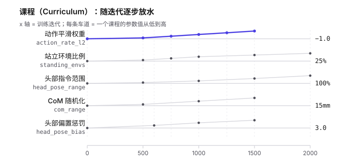
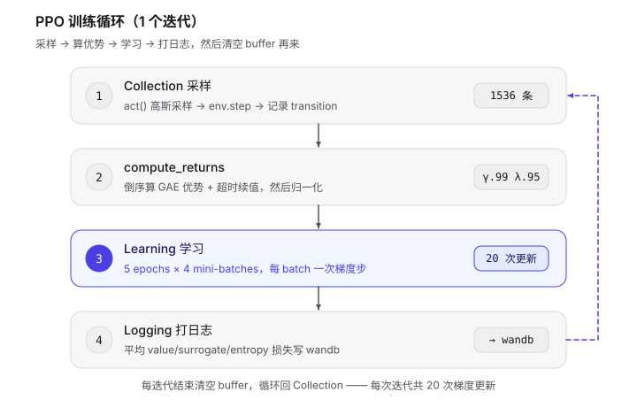
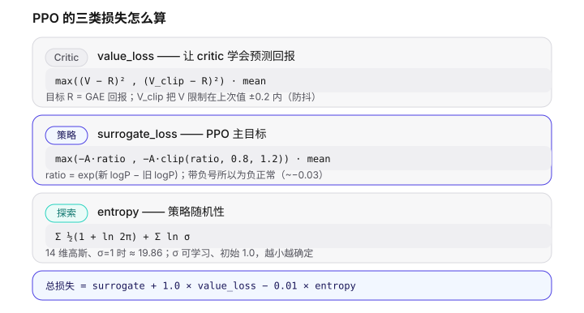
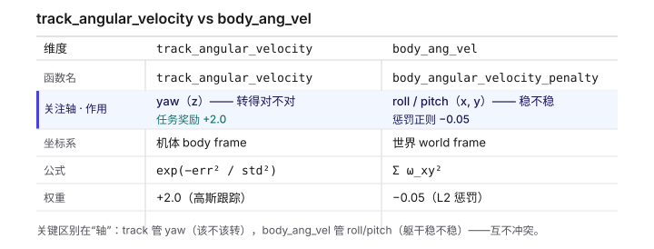
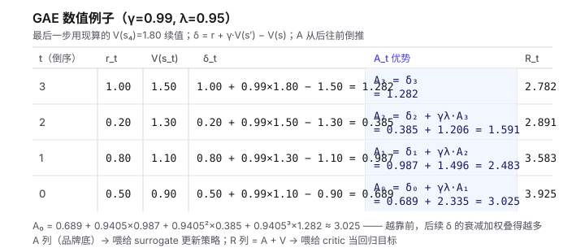

# 学习笔记

## Session 1 补充: 训练循环、损失、课程与 GAE

> 日期: 2026-09-03
> 定位: Session 1 的补充问答（不另算 Session 2，图放 `docs/learning/diagrams/`）
> 内容: 理解 PPO 训练循环、三类损失、Curriculum、符号约定、GAE 深度拆解

***

### 1. Curriculum（课程进度）—— 是固定进度表，不是自适应难度

它不是 AlphaStar 那种自动生成课程的在线算法，而是**按训练步数（env step）分阶段放水的固定计划**。每个迭代 `CurriculumManager` 调用注册的函数，函数读 `env.common_step_counter`，命中第几阶段就把**存活中的 manager cfg** 改掉（注意不是改 `env.cfg`，那在 manager init 时已 deepcopy，是无效写入）。

本环境激活的 5 条课程：

| 课程                             | 初值 → 终值                 | 教什么                        |
| ------------------------------ | ----------------------- | -------------------------- |
| `action_rate_weight`           | -0.1 → -1.0 (iter 1500) | 步态学会后才收紧动作平滑惩罚，避免"尝试税"阻止探索 |
| `standing_envs`                | 2% → 25% (iter 2000)    | 逐步增加"零指令原地站立"的环境比例，教静止待机   |
| `head_pose_range`              | 每关节 ±5% → 100% 范围       | 头部指令从极小逐渐放大，由易到难           |
| `com_range` / `head_com_range` | 3mm → 15mm              | 质心随机化（DR）从小扰动渐大            |
| `head_pose_bias_weight`        | 0 → 3.0                 | iter 600 前关闭偏置惩罚，之后渐紧      |

基类默认的 `terrain_levels`（粗糙地形爬升）和 `command_vel` 课程被 `del` 掉。smoke test（5 迭代）只会看到第 0 阶段的值 —— Session 1 里 -0.1 / 0.02 / 0.003 就是各课程第 0 阶段的初值。



***

### 2. PPO 训练循环

每次迭代三阶段：**Collection → compute\_returns → Learning → Logging**，然后清空 buffer 循环。

**Collection（每环境 24 步，共 64×24=1536 条）**

- `act()`: `actor(obs, stochastic_output=True)` 从**高斯分布采样**动作（不是取均值），同时记录 `values`（critic 输出）、`actions_log_prob`、分布参数 `(mean, std)`。obs 先过 `EmpiricalNormalization`（观测归一化）。

- `env.step(action)` → 新 obs、reward、done。

- `process_env_step()`: 存 transition；**timeout 时先做续值**（见第 5 节），再 `storage.add_transition`。

**compute\_returns（GAE）**: 倒序算 TD 误差 δ 和优势 A，详见第 5 节。

**Learning（5 epochs × 4 mini-batches = 20 次梯度更新）**
每次迭代把 1536 条随机打散成 4 个 384 条的 batch，共 20 个 batch，每个都做一次完整前向 + 反向 + `optimizer.step()`。还有**自适应学习率**：算新旧策略 KL，若 `kl > 2×0.01` 就 lr 除以 1.5，若 `kl < 0.005` 就乘 1.5，防止单次更新步子太大。

**Logging**: 20 个 batch 的损失取平均写 wandb，然后 `storage.clear()`。



***

### 3. 三类损失怎么算

每个 mini-batch（`rsl_rl/algorithms/ppo.py`）:

**Critic 损失（value\_loss）= 裁剪的 MSE**
`max((V − R)², (V_clip − R)²).mean()`，目标 R 是 GAE 回报，`V_clip` 把 V 限制在上次值 ±0.2 内。日志 \~0.037 很小，说明 critic 已能较准预测回报。

**PPO 策略损失（surrogate\_loss）= 裁剪的代理目标**

```
ratio = exp(新 logP − 旧 logP)                 # 新旧策略概率比
surrogate         = −A · ratio
surrogate_clipped = −A · clamp(ratio, 0.8, 1.2)
surrogate_loss = max(surrogate, surrogate_clipped).mean()
```

带负号所以**为负是正常且健康的**（日志 \~−0.03）。裁剪限制单次更新步长。

**策略随机性（entropy）= 高斯熵（熵奖励）**
Actor 用**对角高斯分布、可学习标准差**（初始 `init_std=1.0`）。对 d 维独立高斯，熵 = `d/2·(1+ln2π) + d·lnσ`。14 维动作、σ=1 时 = 7×2.8379 ≈ **19.86**，正好对应 Session 1 日志的 19.8564；σ 越小策略越确定，熵越小。

**总损失** = `surrogate + 1.0×value_loss − 0.01×entropy`（熵项鼓励探索，防止策略过早坍缩成确定性）。



***

### 4. 符号约定与两个角速度项

#### 为什么 `action_rate_l2` 是负的

它定义在 `mjlab/envs/mdp/rewards.py`，返回 `sum((action − prev_action)²)`，是**非负的"成本"**（越大越抖）。RewardManager 算 `weight × func()`，所以要变成惩罚，权重必须为负。这就是符号约定：**mjlab 基类成本函数返回 ≥0 → 权重取负**。若设成正的，机器人会疯狂抖动去"刷"这个奖励。它的绝对值还被课程渐升 -0.1 → -1.0。

#### `track_angular_velocity` vs `body_ang_vel`

| <br /> | `track_angular_velocity`     | `body_ang_vel`                    |
| ------ | ---------------------------- | --------------------------------- |
| 真名     | `track_angular_velocity`     | `body_angular_velocity_penalty`   |
| 公式     | `exp(−err² / std²)`，std=√0.5 | `Σω_xy²`（不含 z）                    |
| 关注轴    | **yaw（z 轴）**，body frame      | **roll/pitch（x、y 轴）**，world frame |
| 符号/权重  | +2.0 任务奖励                    | −0.05 惩罚                          |
| 目的     | 让机器人转到指令要求的角速度               | 惩罚躯干乱晃/翻滚                         |

关键区别: track 管"该不该转"（yaw，追指令，正奖励）；body\_ang\_vel 管"躯干稳不稳"（roll/pitch，抑制乱晃，负惩罚）——它故意**排除 yaw**，因为 yaw 正是被指令要求的动作。观测里的 `base_ang_vel`（3 维 IMU 角速度）是网络输入，跟这两个奖励都不是一回事。



***

### 5. GAE 深度拆解

#### 5.1 在解决什么问题

PPO 目标里用"优势" `A(s,a) = Q(s,a) − V(s)`（这个动作比平均水平好多少）。两个极端估计各有利弊:

- **TD(0)（λ=0）**: 只用一步 `r + γV(s′) − V(s)`。方差小、偏差大（全信 critic）。

- **Monte Carlo（λ=1）**: 用整段真实奖励。偏差小、方差大（整条轨迹噪声进来）。

GAE 用 λ 做**指数加权插值**，本环境 `λ=0.95` 偏向"多用几步真实奖励、少信 critic"。

两个超参数: `γ=0.99` 折扣因子（1 步 = 0.02s，约 100 步后奖励衰减到 1/e）；`λ=0.95` 管回溯多少步（γλ≈0.94，约 15 步前的误差权重衰减到一半）。

#### 5.2 代码逐行（`compute_returns`）

```python
last_values = self.critic(obs).detach()      # ① 对最后一个 obs 单独估 V(s_24)
advantage = 0                                 # ② A_{25} 初值 = 0
for step in reversed(range(24)):              # ③ 倒着算: t = 23 → 0
    next_values = last_values if step == 23 else st.values[step + 1]
    next_is_not_terminal = 1.0 - st.dones[step].float()
    delta = st.rewards[step] + next_is_not_terminal * γ * next_values - st.values[step]   # ④
    advantage = delta + next_is_not_terminal * γ * λ * advantage                          # ⑤
    st.returns[step] = advantage + st.values[step]                                        # ⑥
st.advantages = st.returns - st.values                                                   # ⑦
st.advantages = (st.advantages - st.advantages.mean()) / (st.advantages.std() + 1e-8)    # ⑧
```

- **①**: 传给 `compute_returns` 的 obs 是第 24 步**之后**的"下一状态"，现算一次 critic 得 `V(s_24)` 作为最后一条 transition 的续值。

- **③ 倒序的原因**: 递归 `A_t = δ_t + γλ·A_{t+1}` 需要先知道 `A_{t+1}`，`advantage` 变量一路把 `A_{t+1}` 带过来。

- **④ δ = TD 误差**: `δ_t = r_t + γ·V(s_{t+1})·(1−done) − V(s_t)`。真结束（摔倒）则 `(1−done)=0`，没有未来。

- **⑤ GAE 递归**: `A_t = δ_t + γλ·(1−done)·A_{t+1}`，展开 = 1 步、2 步…TD 误差按 `(γλ)ᵏ` 加权求和。

- **⑥ returns**: `R_t = A_t + V(s_t)` 是 **critic 的回归目标**。

- **⑦ advantages**: `returns − values` = 上面算的 `A_t`，是 **surrogate 的权重**。

- **⑧ 归一化**: 整个 buffer 的 advantage 减均值除标准差，让更新步长不随奖励尺度漂移，也让 clip 阈值 0.2 有意义。

#### 5.3 timeout 续值（关键坑）

Session 1 日志里 `time_out: 0.58`——58% 的 episode 是超时结束，不是摔倒。不处理的话 GAE 会把超时当真的终止，回报截断，critic 系统性低估"继续走下去"的价值。

处理分两步:

1. `vecenv_wrapper.py`: `dones = terminated | truncated`（超时在存储里 `done=True`），同时 `extras["time_outs"] = truncated` 单独标记。
2. `process_env_step`: 存 buffer **之前**把 `γ·V(s_t)` 直接加到 reward 上。

净效果: 超时那步 `done=True` → GAE 不再往后递归（⑤ 的 `(1−done)=0`）；但 reward 已含 `γ·V(s_t)`，回报没丢未来价值。两条路径合起来等价于"超时不截断"。

#### 5.4 数值例子（γ=0.99, λ=0.95）



读法: t=3（最后一步）用现算的 `V(s₄)=1.80` 续值，`δ₃=1.282`，因无后续所以 `A₃=δ₃`；从 t=2 起每步 `A_t = δ_t + γλ·A_{t+1}`（γλ=0.9405）。越靠前 A 越大——t=0 的 `A₀` 把后面每一步的 δ 按衰减权重全叠进来了。算完 `A` 喂 surrogate、`R` 喂 critic，然后进入 20 次梯度更新。

***

## 参考资源

- `rsl_rl/algorithms/ppo.py` — PPO / GAE / timeout 续值

- `rsl_rl/modules/distribution.py` — 高斯分布 / 熵 / 可学习 σ

- `mjlab/tasks/velocity/mdp/rewards.py` — track\_angular\_velocity, body\_angular\_velocity\_penalty

- `mjlab/envs/mdp/rewards.py` — action\_rate\_l2

- `mjlab/rl/vecenv_wrapper.py` — dones = terminated | truncated

- AGENTS.md — 符号约定、奖励设计规则、课程与训练经验

- Session 1 笔记: `session-01.md`

